# 🏠 UniEv – University Housing & Roommate Matching Platform

<div align="center">


### Software Laboratory II Project

### Kocaeli Sağlık ve Teknoloji Üniversitesi

2025–2026 Spring Semester

</div>

---

# 🔗 Live Demo

[🌐 Open UniEv Live Demo](https://uniev.onrender.com)

---

# 📖 Project Description

UniEv is a full-stack web platform designed to help university students find secure rental housing and compatible roommates.

The platform provides a centralized environment where students can create housing listings, search available accommodations, communicate with other users, manage personal profiles, and discover suitable roommates based on lifestyle and budget compatibility.

The project was developed as part of the Software Laboratory II course and focuses on solving common accommodation challenges faced by university students.

---

# 🎯 Project Purpose

Finding safe and affordable housing is one of the most common challenges for university students.

The purpose of UniEv is to:

- Provide a secure housing platform for students
- Reduce fraud risks in rental listings
- Help students find compatible roommates
- Simplify communication between tenants and landlords
- Improve accessibility to housing opportunities
- Create a reliable and user-friendly accommodation ecosystem

---

# 🛠️ Technologies Used

## Backend

- Python 3.12
- FastAPI
- SQLAlchemy ORM
- Socket.IO

## Frontend

- HTML5
- CSS3
- Tailwind CSS
- Jinja2 Templates

## Database

- SQLite

## Authentication & Security

- JWT Authentication
- Argon2 Password Hashing

## Additional Libraries

- Google Maps API
- python-dotenv
- aiosmtplib
- cuid2

---

# 🚀 Installation Steps

## Clone Repository

```bash
git clone https://github.com/SoDiablo/uniev.git
```

## Enter Project Directory

```bash
cd uniev
```

## Create Virtual Environment

```bash
python -m venv venv
```

## Activate Virtual Environment

### Windows

```bash
venv\Scripts\activate
```

### Linux / macOS

```bash
source venv/bin/activate
```

## Install Dependencies

```bash
pip install -r requirements.txt
```

---

# ▶️ Running the Project

Start the application using:

```bash
uvicorn main:socket_app --host 0.0.0.0 --port 8000
```

Open the application in your browser:

```text
http://localhost:8000
```

---

# ✨ Features

## User Management

- User Registration
- User Login
- Email Verification
- Password Reset
- JWT Authentication
- Profile Management
- Profile Photo Upload
- Account Security

## Housing Management

- Create Listings
- Edit Listings
- Delete Listings
- Search Listings
- Listing Details
- Image Upload Support

## Roommate Matching

- Preference-Based Matching
- Lifestyle Compatibility Analysis
- Budget Compatibility
- Intelligent Matching System

## Real-Time Messaging

- Instant Messaging
- Conversation History
- Socket.IO Integration
- Read Status Tracking

## Security Features

- JWT Authentication
- Argon2 Password Hashing
- Account Lockout Protection
- Email Verification
- Input Validation
- Role-Based Authorization

## Fraud Prevention

- FraudScore System
- Listing Trust Evaluation
- Risk Analysis
- Fraud Detection Support

## Location Services

- Google Maps Integration
- Location Visualization
- SafetyMap System
- Neighborhood Safety Information

## Administrative Tools

- Admin Dashboard
- User Management
- Listing Moderation
- Reports Management
- Audit Logging

## Additional Features

- Favorites System
- Notification System
- Rating System
- KVKK Compliance Support
- User Consent Management

---

# 📸 Screenshots

## Home Page


---

## Listings Page

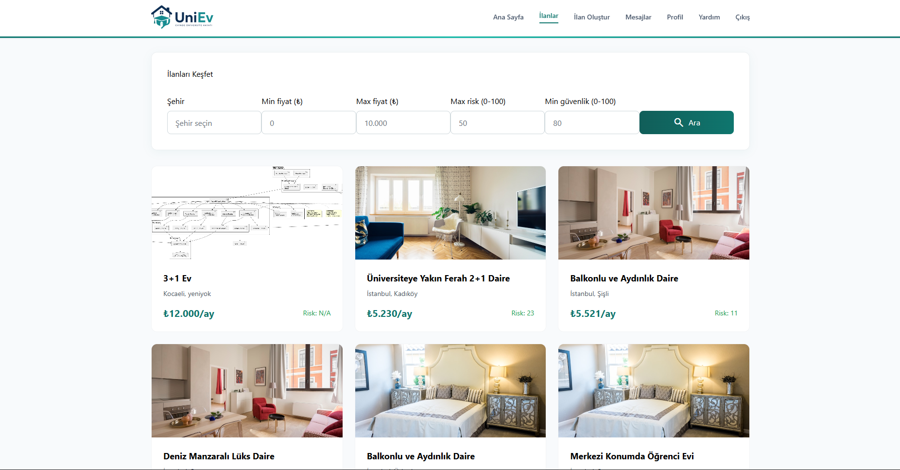

---

## Listing Details

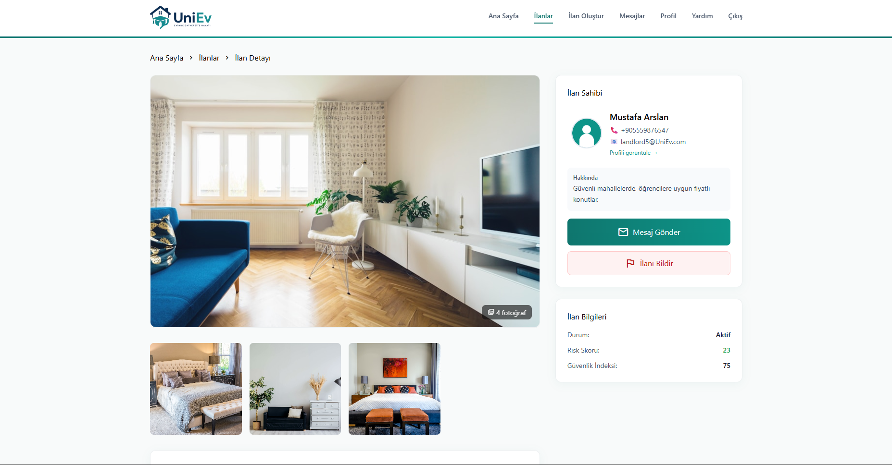

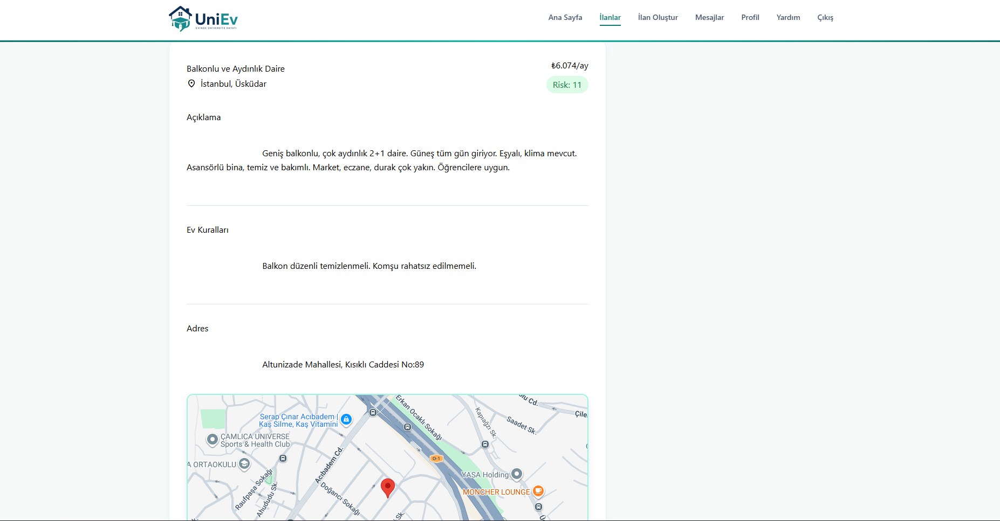

---

## Create Listing

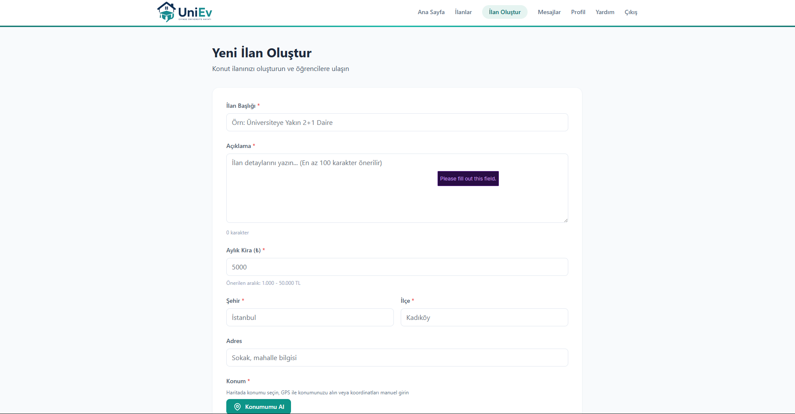

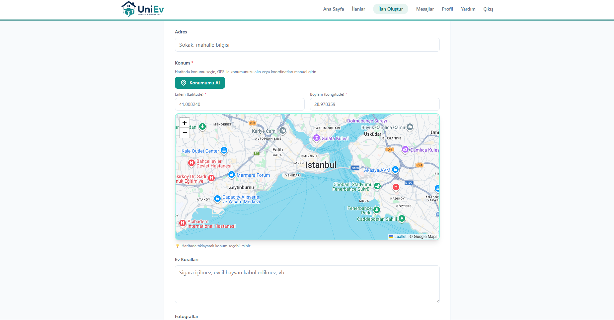

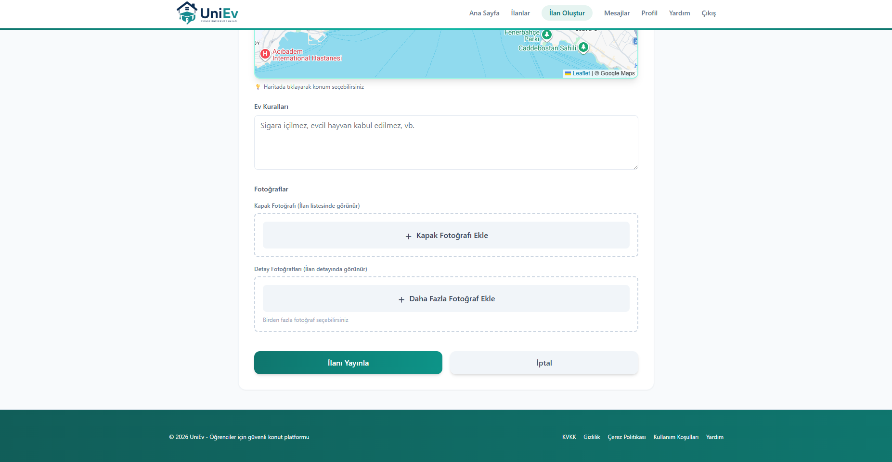

---

## Messaging System

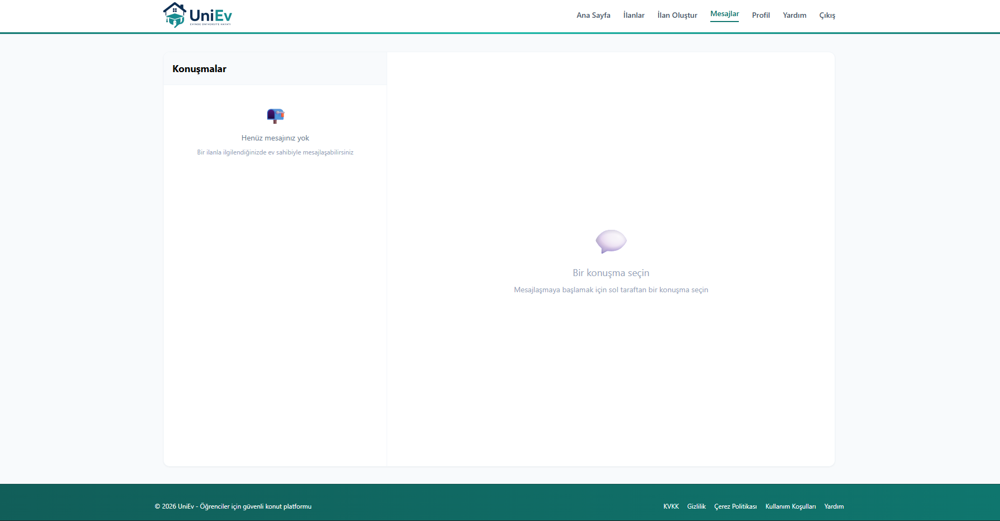

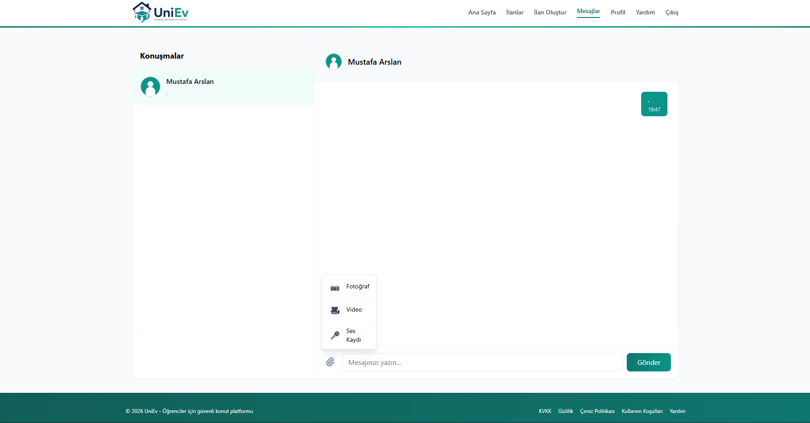

---

## Profile Management

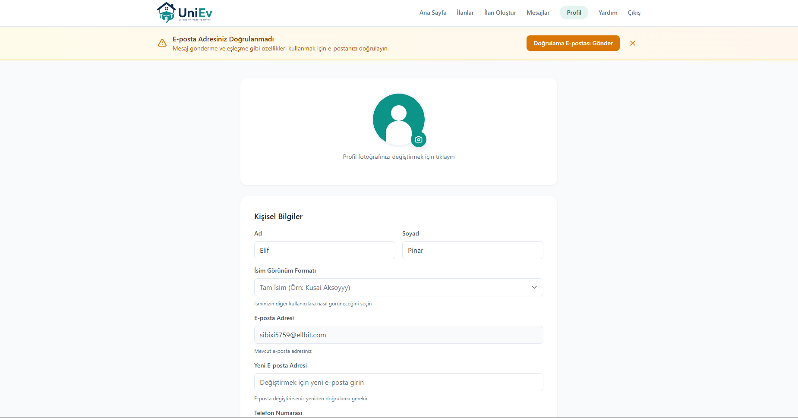

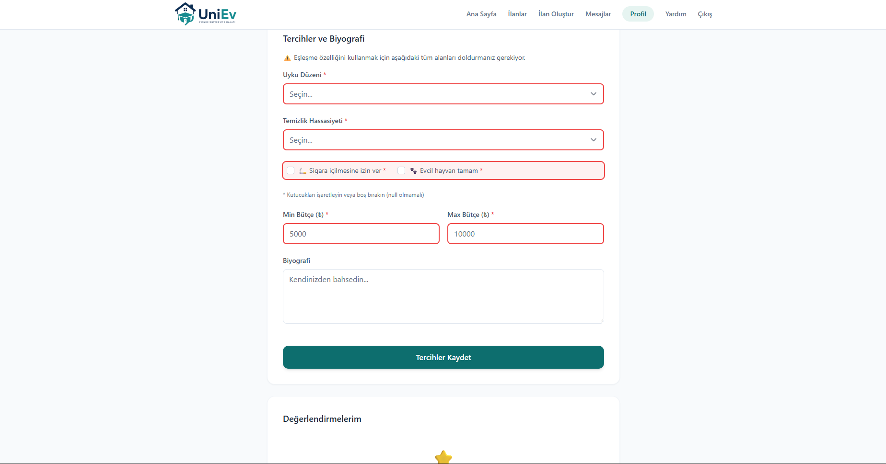

---

## Help Page

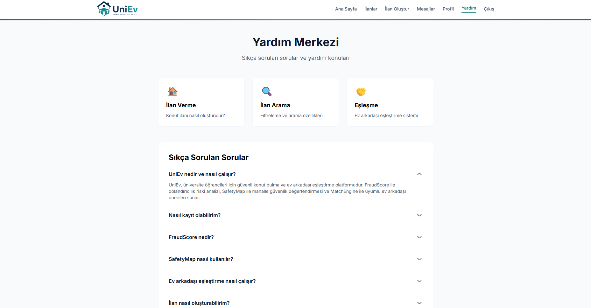

---

## Administration Panel

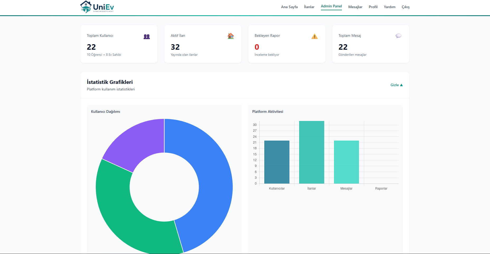

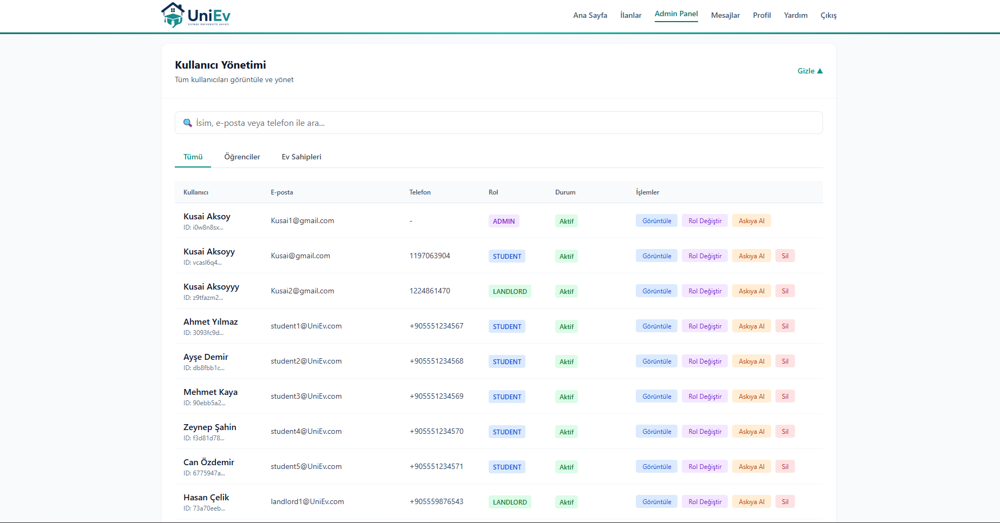

---

## Roommate Matching System

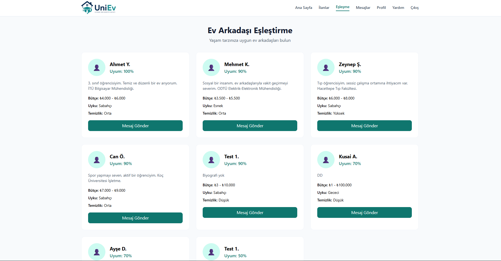

---

## Public User Profile

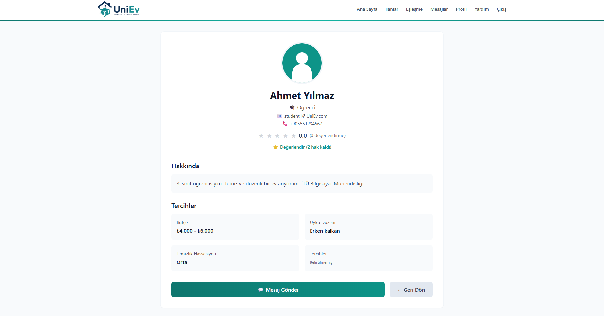

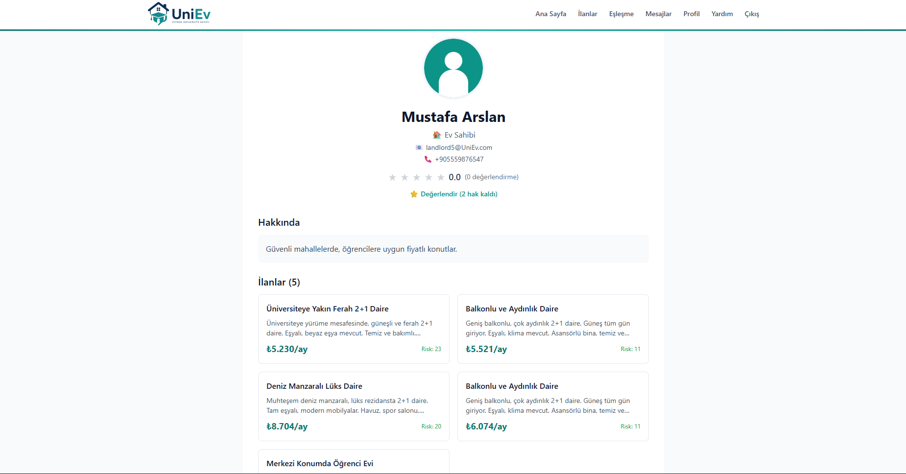

---

## Authentication

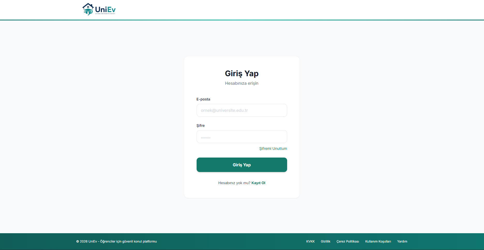

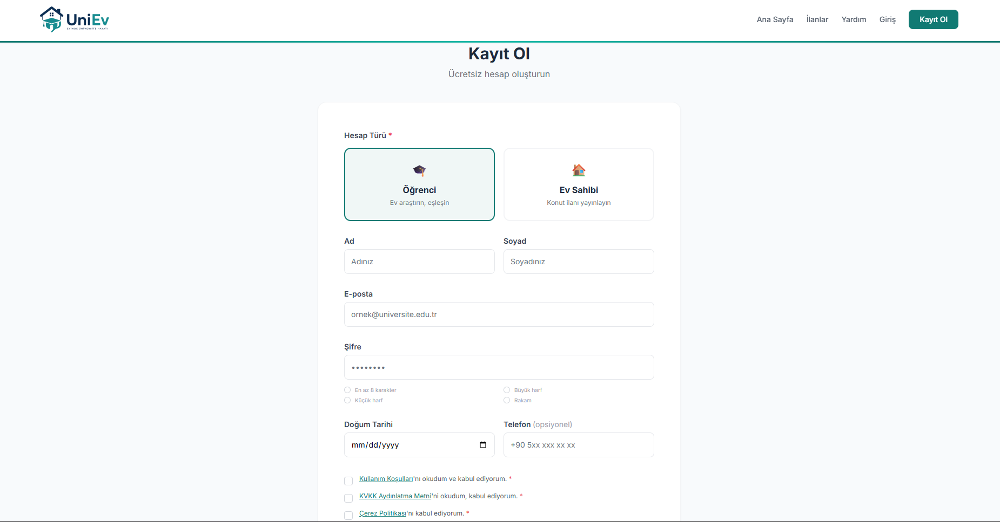

---

# 📊 UML & System Diagrams

## Activity Diagram


## Authentication Flow Diagram


## ER Diagram


## Listing Creation Flow Diagram


## Match Engine Flow Diagram


## Real-Time Messaging Flow Diagram


---
# 📄 Improvement Report

The detailed report describing the improvements, refactoring, bug fixes, and enhancements made for Project 3 can be accessed below:

📑 [View Improvement Report](documentation/UniEv_2Rapor_Degisiklikler.pdf)

---
# 🎥 Project Launch Video

Watch the project introduction video here:

🔴 [YouTube Video Link Here](YOUR_LINK_HERE)

---
# 📂 Folder Structure

```text
UniEv/
│
├── core/
│   ├── auth.py
│   └── security.py
│
├── routers/
│   ├── auth.py
│   ├── users.py
│   ├── listings.py
│   ├── messages.py
│   ├── match.py
│   ├── reports.py
│   ├── ratings.py
│   ├── favorites.py
│   ├── notifications.py
│   ├── privacy.py
│   ├── safety.py
│   ├── upload.py
│   └── admin.py
│
├── services/
├── sockets/
├── static/
├── templates/
├── uploads/
│
├── screenshots/
│
├── documentation/
│
├── tests/
│
├── database.py
├── main.py
├── requirements.txt
├── .gitignore
└── README.md
```

---

# 💡 Development Suggestions

Potential future improvements include:

- Mobile Application Development
- AI-Based Recommendation System
- Multi-Language Support
- Push Notifications
- Payment Integration
- Property Verification Service
- Social Login Integration
- Advanced Search Filters
- User Reviews and Comments
- Dark Mode Support

---

# 👥 Contributors

| Name | Student Number | Role |
|--------|--------|--------|
| Kusai Aksoy | 230501002 | Team Leader |
| Hashem Salem | 230502064 | Data Modeling |
| Namık Hasan | 230501055 | UML Diagrams |
| Rama Hasanatu | 230502053 | User Interface Design |
| Melih Kamil USLU | 230501059 | Documentation & UI Design |

---

## 🎓 Course Information

**University:** Kocaeli Sağlık ve Teknoloji Üniversitesi

**Course:** Software Laboratory II

**Semester:** 2025–2026 Spring

**Project:** Project 3

---

## 📄 License

This project was developed for educational purposes as part of the Software Laboratory II course.

All rights belong to the project team.
